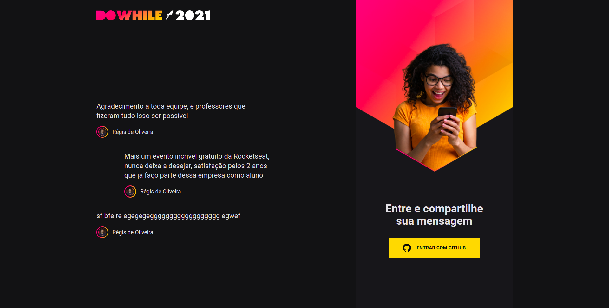

# NLW---Heat-ReactJS

<h3 align="center">
  App with ReactJS and SocketIO to show real-time chat, and login with Github Oauth
</h3> 

<h1>
  
</h1>

## :open_file_folder: About

The App its about a real-time chat, created during **NLW** event by **Rocketseat**

</br>

## :rocket: Technologies

- [ReactJs](https://reactjs.org)
- [Axios](https://axios-http.com/)
- [SocketIO](https://socket.io)
- [Vite](https://vitejs.dev/)
- [Sass](https://sass-lang.com/)

</br>

## :key: How to download the project

```bash
# clone the repo:
$ git clone https://github.com/Regis-Oliveira/NLW---Heat-ReactJS.git

# open the project:
$ cd NLW---Heat-ReactJS

# install the dependencies:
$ yarn install

# execute with:
$ yarn dev
```

### :tada: See the app executing on:

 - [http://localhost:3000](http://localhost:3000/)

 </br>

 ## :sos: Important

 To be possible **send** messages, to **login on your account** and see the beauty of **real-time**, there are more steps extremely necessary:

 - Feel free to access the backend from this app:
 - [Link to BackendRepo](https://github.com/Regis-Oliveira/NLW---Heat-NodeJS)

 ```bash
 # first, clone the backend repo:
 $ git clone https://github.com/Regis-Oliveira/NLW---Heat-NodeJS.git

 # open the project:
 $ cd NLW---Heat-NodeJS

# install the dependencies:
$ yarn install

# open the project with vscode or other editor that you prefer, and create an .env file and add this variables below:

- GITHUB_CLIENT_SECRET=
- GITHUB_CLIENT_ID=
- JWT_SECRET=executingProjectToTest

# to create the client id and client secret:
- Access your github account
- Click on Settings
- Developer Settings
- OAuth Apps
- New OAuth Apps
- Follow the git paths and copy the Client Id and create the SecretId
- Add the values on your .env file
- Save the auterations (Ctrl + s)

# create all the tables to the bank
$ yarn prisma migrate dev

# execute with:
$ yarn dev
 ```
 </br>

 ## :fire: Credits
 The enterprise responsible to this event and to this application: 
 [Rocketseat](https://app.rocketseat.com.br/)

 </br>

 ## :pencil2: Contact Me

- [Linkedin](www.linkedin.com/in/regis-de-oliveira-cardoso)
- :inbox_tray: Email: (oliveiracregis01@gmail.com)

</br>

---
Desenvolvido com :heart: por **Régis de Oliveira Cardoso**.